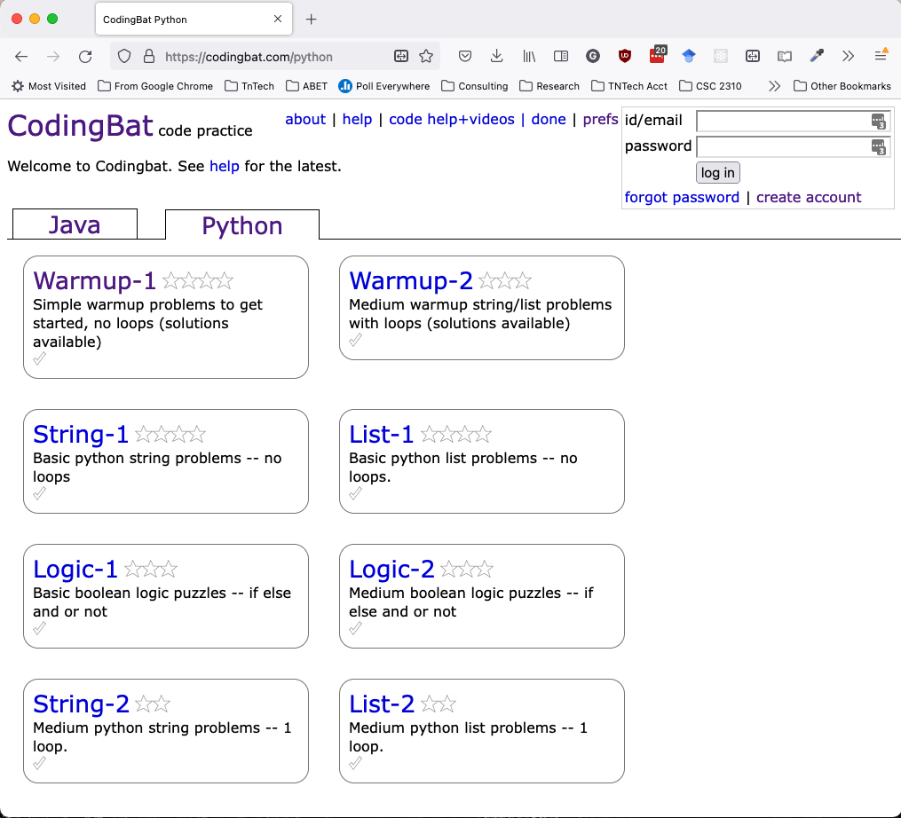

## Introduction to Python using Codingbat
### CSC 2310

In this lab you will begin learning Test-Driven Development (TDD) and the Python programming language by writing code using the [codingbat](https://codingbat.com/python) website.

#### Pre-work
This laboratory makes use of the [https://codingbat.com/python](https://codingbat.com/python) website, which contains several exercises for practicing programming using Python. The site uses a _Test-Driven Development_ (TDD) approach for programming whereby tests are written first and the goal of the programmer is to make their code pass the test.

Before starting the lab, go to the above link and create an account using your TNTech email address by selecting the ``create account`` link. Create your account using your TNTech e-mail address.

Next, add your lead TA's e-mail address to the **Teacher Share** field, and your Section number to the **Memo** field using the **prefs** menu: 
  * Section 101 (T 8:00am) and 102 (R 8:00am): Aminul Islam (mislam49@tntech.edu)
  * Section 103 (T 4:30pm) and 104 (R 4:30pm): Samuel Hassler (schassler42@tntech.edu)

The screens below show you what you can expect to see in the system. 

### Laboratory Description

After creating and configuring your account (and during the assigned lab period), attempt and complete the following exercises:

* String-1/make_tags: https://codingbat.com/prob/p132290
* List-1/reverse3: https://codingbat.com/prob/p192962
* Logic-1/date_fashion: https://codingbat.com/prob/p129125

The approach you should use to complete these exercises is the following:

1. Add a `pass` statement to the code block
2. Click the "Go" button to observe the tests fail
3. Write the code to make the tests pass

After the laboratory session, and before the beginning of your next laboratory, you must complete the following exercises:

* String-1/make_out_word: https://codingbat.com/prob/p129981
* List-1/make_pi: https://codingbat.com/prob/p113659
* Logic-1/alarm_clock: https://codingbat.com/prob/p119867

In addition, you must complete at **least 4 more** exercises _excluding those from Warm-Up_.

#### Turn-in

Remember to add your lab instructor to the **Teacher Share** field in the *prefs* menu and your section number to the **Memo** field. **The TA's will create a snapshot of the lab completion report no later than 10 minutes after the assigned laboratory section ends.** You must complete the additional exercises before the end of the next laboratory. 

This laboratory is worth 20 points.