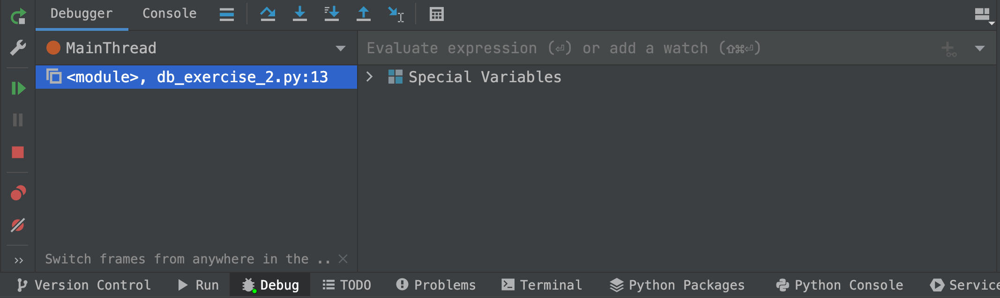
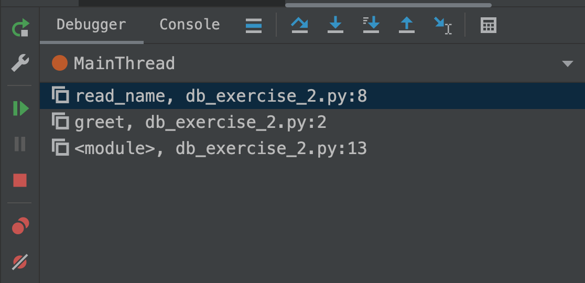

### Lab 08 Debugging

#### Setup
Download the git repository using the following command:

```bash
git clone https://gitlab.csc.tntech.edu/csc2310-fa22-students/<%userid%>/<%userid%>-lab-08-debugging.git
```
replacing `%userid%` with your own TNTech issued userid.

The python debugger in PyCharm has two main windows: the stack area (left) and the variable display area (right)

 

The debugger has several basic features that support controlling
the debugger, including:
* Resume: 
* Step Over: 
* Step Into: 

#### Step through function and changing the value of a variable
The first exercise demonstrates how the debugger can be used to step through a program. A key
feature of debuggers is the use of breakpoints.
* Load `db_exercise_1.py` and create a run configuration
* Set a breakpoint on line 1
* Start the debugger by clicking the bug icon
* Step through the program to see the program display `hello alice`

Using the same program, use the debugger to change the value of a variable in a program.
* Restart the program with a breakpoint on line 1
* Find the variable information for the `name` variable in the lower right-hand area of PyCharm
* Right-click the entry and select "Set Value"
* Set the value to `bob`
* Click `Resume`

#### Step into
The "Step Into" feature allows you to navigate into a called function. The 
debugger has a stack frame that allows you to see a trace of the methods
called in the program.
* Load `db_exercise_2.py` and create a run configuration
* Set a breakpoint at Line 13
* Click the `Step Into` button; the program should enter the `greet` function
  * Continue by also using `Step Into` to enter the `read_name` method
  * Make note of the stack on the left-hand side of the debugging frame

  

  * The top of the stack should be `read_name` followed by `greet`
* Select `Step Over` and switch to the `Console` tab to enter a name
* Click `Resume`

#### Finding problems
The primary reason of using a debugger is to identify problems. This exercise demonstrates
the power of the debugger in addressing code issues.
* Load `db_exercise_3.py` and create a run configuration; set the inputs for the program to `1` and `50`
* Inspect the code at Line 5. Based on this, what do you expect the output of the program to be?
* Run the program (rather than debugging) to observe the result
* Set a breakpoint at Line 9 and `Step Over` lines 9 and 10. 
  * What are the values and types of the variables `a` and `b`?
* Restart the program with the same breakpoints
  * When you reach line 9, `Step Over` the line and then set the value to integer value 1
  * When you reach line 10, `Step Over` the line and then set the value to integer value 50
* Click `Resume` and repeat until the program produces 101 as the output
* Correct the program. Hint: `int(v)` converts variable `v` into an integer.

#### Finding more problems
`db_exercise_4.py` contains an error. Use the debugger to correct the program so that it 
executes in all cases, including the error case.

#### Turn-in
The files `db_exercise_3.py` and `db_exercise_4.py` must be corrected and pushed back
to the repo.

```bash
git add .
git commit -m "Corrected code"
git push -u origin master
```

The lab is worth 20 points and is due 1 week after assigned.